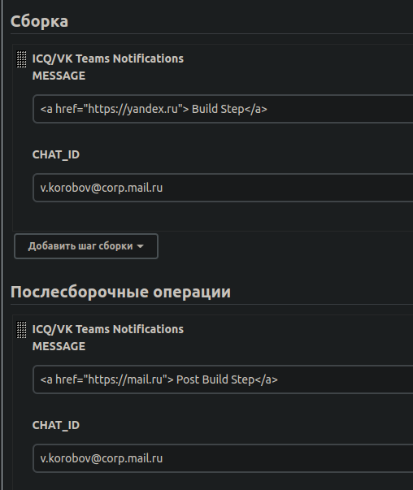

# ICQ/VK Teams Notifications plugin for Jenkins CI


## Introduction

Plugin for text notifications from Jenkins CI to ICQ/Agent/VK Teams with Bot API.
Supports env vars replacing in provided message text.

## Getting started

### 1. Create bot with @Metabot

### 2. Build plugin

```bash
git clone https://github.com/dasshit/icqnotifications.git
mvn package
```

### 3. Install plugin in Jenkins settings

### 4. Configure global plugin settings

## Usage

### Can be set as Build Step



## Or used in pipelines
```
pipeline {
    agent any

    stages {
        stage('Hello') {
            steps {
                imSendMessage(MESSAGE: "Build Step!\n\nWORKSPACE: $WORKSPACE", CHAT_ID: "ApLWcbXOhA-EZYAN")
            }
        }
    }
    post {
        always {
            imSendMessage(MESSAGE: "Post Build Step!\n\nWORKSPACE: $WORKSPACE", CHAT_ID: "ApLWcbXOhA-EZYAN")
        }
    }
}
```
## And Groovy pipelines
```groovy
node {
    stage('Example') {
        try {
            imSendMessage(MESSAGE: "Build Step!\n\nWORKSPACE: $WORKSPACE", CHAT_ID: "ApLWcbXOhA-EZYAN")
        } catch (e) {
            println e
        }
    }
}
```

## LICENSE

Licensed under MIT, see [LICENSE](LICENSE.md)

